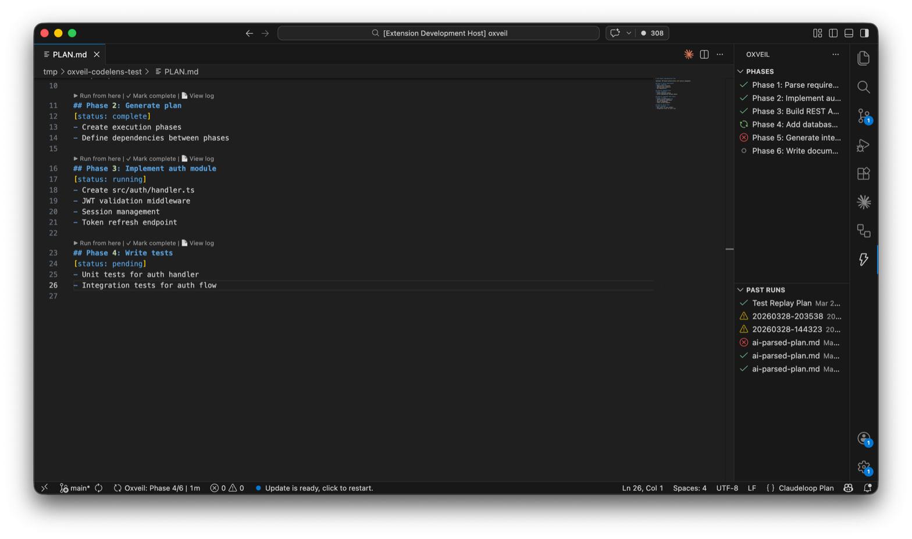
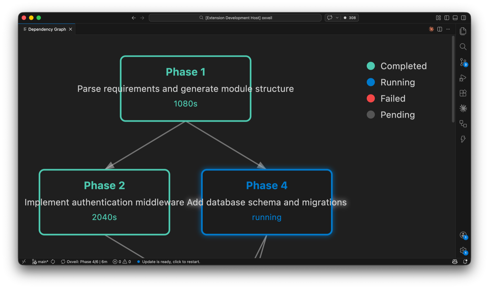
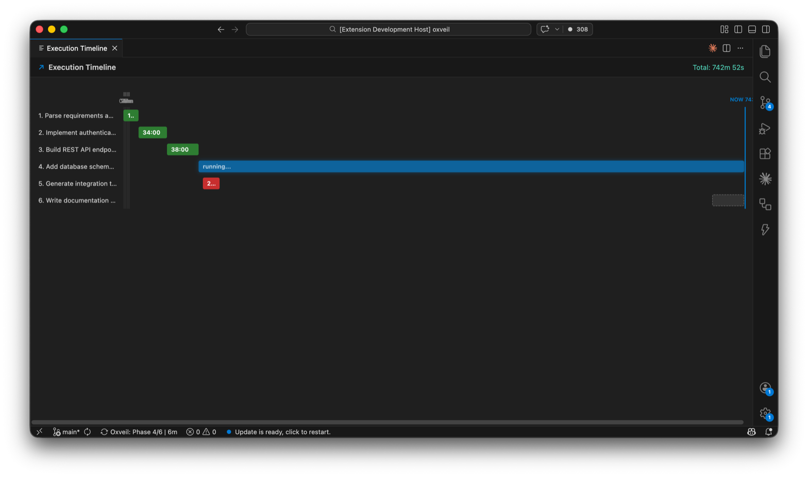
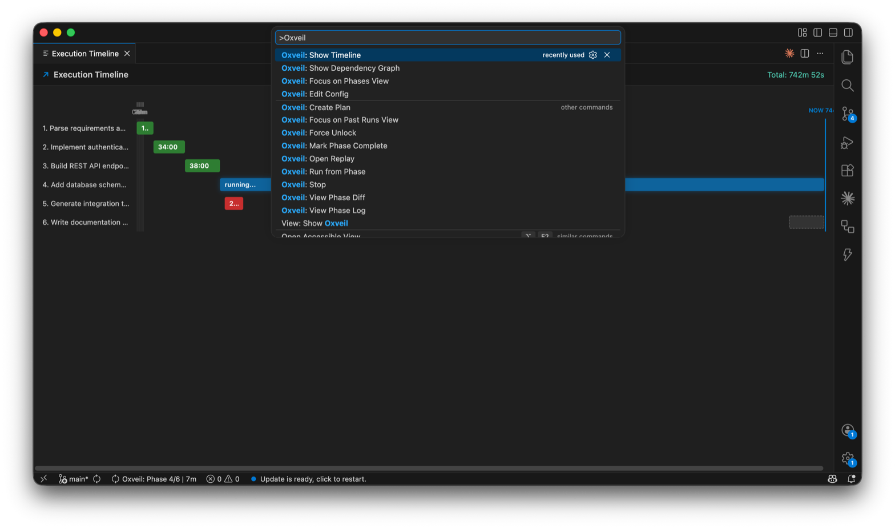
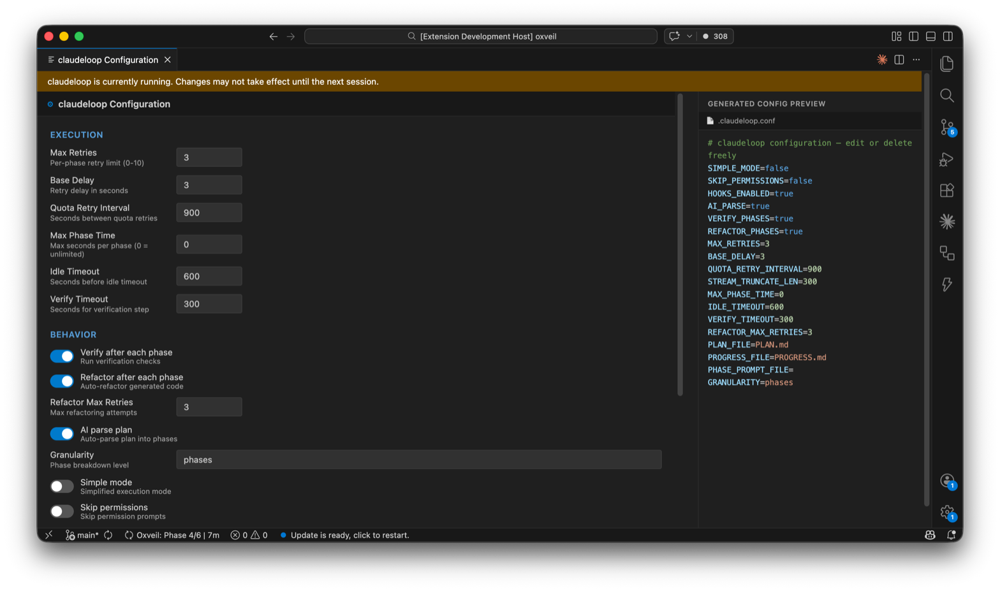
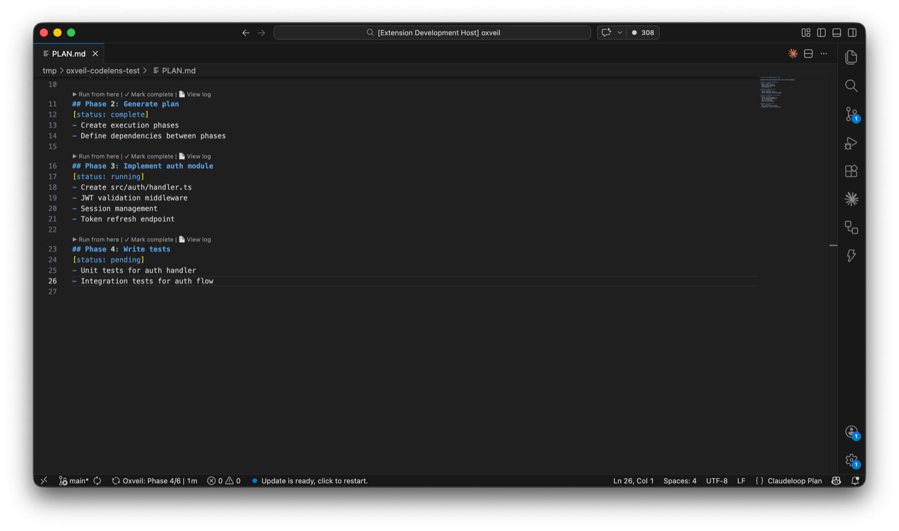
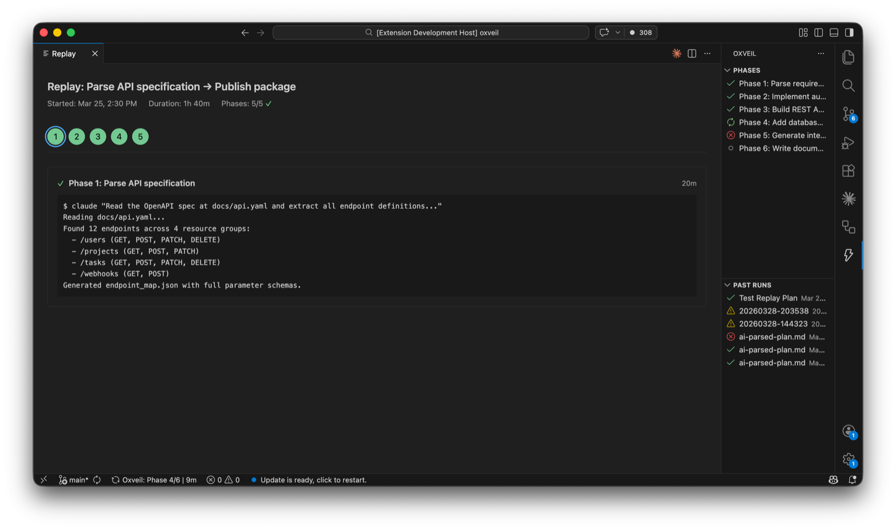

<p align="center">
  <strong>Oxveil</strong><br>
  Visual command center for <a href="https://github.com/chmc/claudeloop">claudeloop</a> in VS Code.
</p>

<p align="center">
  <a href="https://github.com/chmc/oxveil/releases"></a>
  <a href="https://github.com/chmc/oxveil/stargazers"></a>
  
</p>

- **See everything** — Live Run Panel, phase tree, dependency graph, execution timeline, and status bar show exactly where your run stands
- **Control everything** — start, stop, reset, run from any phase, mark complete, archive and replay — all without leaving the editor
- **Configure everything** — graphical config wizard, syntax-highlighted plan editing, AI-powered plan decomposition

<p align="center">
  
</p>

## The Problem

claudeloop runs in the terminal. Monitoring progress means tailing log files. Controlling execution means memorizing CLI flags. Configuring settings means hand-editing `.claudeloop.conf`. You switch between terminal, editor, and file browser constantly — context-switching that kills your flow.

Oxveil puts everything in one place. Live monitoring, one-click execution control, visual config editing, and syntax-highlighted plan authoring — all inside VS Code where you're already working.

| | Terminal | **Oxveil** |
|---|---|---|
| **Monitor progress** | Tail log files | Live Run Panel + phase tree + status bar |
| **Control execution** | CLI flags | Click to start, stop, run from phase |
| **Edit config** | Hand-edit `.claudeloop.conf` | Graphical wizard with bidirectional sync |
| **Write plans** | Plain text editor | Syntax highlighting + CodeLens actions |
| **Review past runs** | `ls .claudeloop/archive/` | Archive browser + replay viewer |
| **Multi-root projects** | One terminal per folder | Per-folder sessions, auto-resolved |

## Quick Start

1. **Install** the Oxveil extension from the VS Code Marketplace
2. **Detect claudeloop** — Oxveil finds your install automatically, or offers one-click install if missing
3. **Run the walkthrough** — `Cmd+Shift+P` > `Get Started: Open Walkthrough...` > Oxveil

The walkthrough guides you through setup: detect claudeloop, configure your project, create a plan, and start your first run.

## Features

### Monitoring

| Feature | Description |
|---------|-------------|
| **Live Run Panel** | Webview dashboard with collapsible phase list, todo progress bar, formatted log stream, and completion banner |
| **Phase tree** | Sidebar tree view with live status icons, click-to-open logs, and context menu actions |
| **Status bar** | Real-time phase name and progress in the VS Code status bar |
| **Dependency graph** | Interactive DAG webview showing phase dependencies with live updates |
| **Execution timeline** | Gantt-style timeline of phase durations and retry attempts |
| **Notifications** | Failure alerts with attempt count and quick actions (View Log) |

<p align="center">
  
</p>

<p align="center">
  
</p>

### Execution

| Feature | Description |
|---------|-------------|
| **Start / Stop / Reset** | Full lifecycle control from the Command Palette or sidebar |
| **Run from phase** | Jump to any phase and execute from there |
| **Mark complete** | Manually mark a phase as completed when it succeeded but was logged as failed |
| **Force unlock** | Take over a stale lock from a crashed session |

<p align="center">
  
</p>

### Configuration

| Feature | Description |
|---------|-------------|
| **Config wizard** | Graphical editor for `.claudeloop.conf` with bidirectional file sync — edit in the UI or the file, both stay in sync |
| **VS Code settings** | All runtime flags (verify, refactor, dry-run, AI parse) exposed as standard VS Code settings |

<p align="center">
  
</p>

### Plan Editing

| Feature | Description |
|---------|-------------|
| **Syntax highlighting** | Dedicated TextMate grammar for claudeloop plan files — phase headers, dependency declarations, and directives are highlighted |
| **CodeLens actions** | Inline Run / Diff / Log actions at each phase header |
| **AI Parse Plan** | Turn free-form notes into structured phases with configurable granularity |
| **Create Plan** | Scaffold a new plan file from the Command Palette |

<p align="center">
  
</p>

### Archive & Replay

| Feature | Description |
|---------|-------------|
| **Archive browser** | Sidebar view of past session runs with timestamps |
| **Replay viewer** | Inline webview for stepping through archived runs |
| **Restore** | Restore any archived run to resume or re-examine it |

<p align="center">
  
</p>

### Onboarding

A built-in **welcome walkthrough** guides new users through setup:

1. Detect or install claudeloop
2. Configure your project
3. Create or open a plan
4. Start your first run

### Multi-root Workspaces

Oxveil supports VS Code multi-root workspaces natively:

- **Per-folder sessions** — each workspace folder gets its own independent claudeloop session
- **Folder-aware commands** — commands automatically resolve to the active folder, or prompt with a folder picker when ambiguous
- **Folder prefix** — status bar and tree view show which folder a session belongs to

## Requirements

| Requirement | Version |
|-------------|---------|
| VS Code | ^1.100.0 |
| claudeloop | >= 0.22.0 |
| Node.js | >= 20 |

claudeloop is a runtime dependency — Oxveil detects it automatically and offers installation if missing.

## Settings

| Setting | Type | Default | Description |
|---------|------|---------|-------------|
| `oxveil.claudeloopPath` | string | `"claudeloop"` | Path to claudeloop executable |
| `oxveil.watchDebounceMs` | number | `100` | Debounce interval for file watcher events (ms) |
| `oxveil.verify` | boolean | `true` | Run verification after each phase (`--verify`) |
| `oxveil.refactor` | boolean | `true` | Run refactoring after each phase (`--refactor`) |
| `oxveil.dryRun` | boolean | `false` | Preview plan without executing (`--dry-run`) |
| `oxveil.aiParse` | boolean | `true` | Auto-parse plan into phases (`--ai-parse`) |

## Commands

| Command | Description | Available when |
|---------|-------------|----------------|
| `Oxveil: Start` | Start claudeloop execution | claudeloop detected, not running |
| `Oxveil: Stop` | Stop running execution | Process running |
| `Oxveil: Reset` | Reset all run state | claudeloop detected, not running |
| `Oxveil: Force Unlock` | Take over a stale lock | claudeloop detected |
| `Oxveil: Install claudeloop` | Download and install claudeloop | claudeloop not detected |
| `Oxveil: Run from Phase` | Start execution from a specific phase | claudeloop detected |
| `Oxveil: Mark Phase Complete` | Mark a phase as manually completed | claudeloop detected |
| `Oxveil: Edit Config` | Open the graphical config wizard | claudeloop detected |
| `Oxveil: Show Dependency Graph` | Open the interactive DAG view | Always |
| `Oxveil: Show Timeline` | Open the execution timeline | claudeloop detected |
| `Oxveil: Open Replay` | Open the replay viewer | claudeloop detected |
| `Oxveil: AI Parse Plan` | Decompose a plan into phases with AI | claudeloop detected, not running |
| `Oxveil: Create Plan` | Scaffold a new plan file | Always |
| `Oxveil: View Phase Log` | Open log file for a phase | Phase tree context menu |
| `Oxveil: View Phase Diff` | View git diff for a completed phase | Completed phase context menu |

## Architecture

Oxveil follows a reactive architecture: file watchers observe `.claudeloop/` state files, parsers extract structured data, and views render the current state. No polling — all updates are event-driven.

See [ARCHITECTURE.md](ARCHITECTURE.md) for the full technical overview.

## Development

```sh
npm install
npm run build
```

**Iterative development:** Run `npm run watch`, then press F5 to launch the Extension Development Host. Reload with `Cmd+R` after changes.

| Script | Description |
|--------|-------------|
| `npm run build` | Bundle to `dist/` with esbuild |
| `npm run watch` | Rebuild on file changes |
| `npm run lint` | TypeScript type-checking |
| `npm test` | Run tests (vitest) |
| `npm run package` | Package to `oxveil.vsix` |

Releases are automated via GitHub Actions — see the Release workflow.

## License

[MIT](LICENSE)
