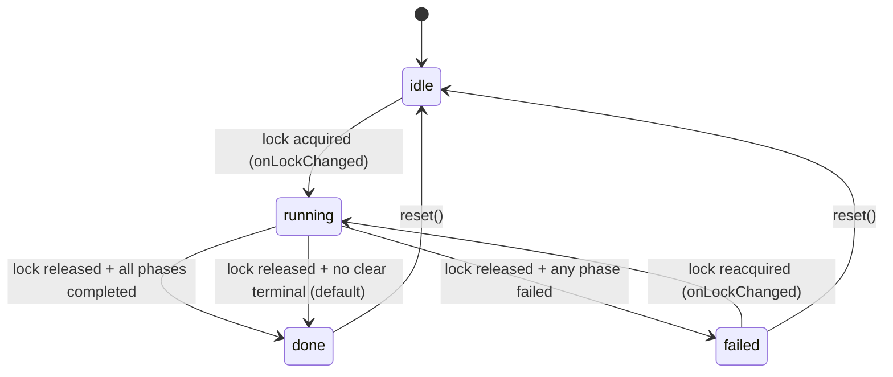
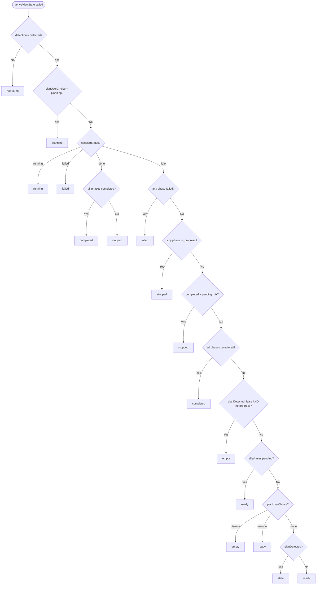
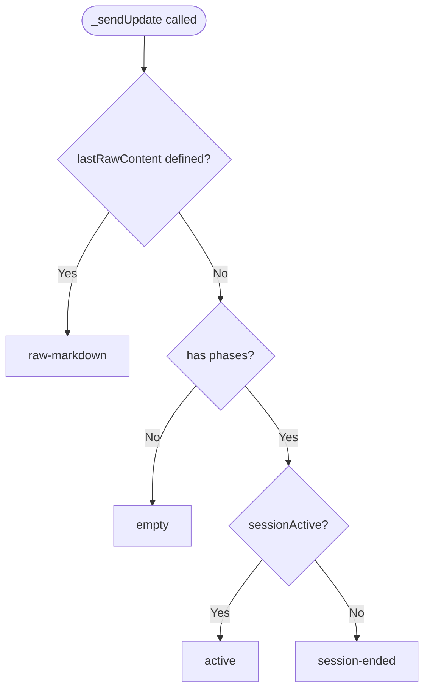

# Oxveil Workflow State Specification

This document is the single source of truth for Oxveil's UI state systems. It covers four state systems, their interactions, message schemas, and the complete user journey through 10 user stories.

**Key distinction:** Only `SessionState` is a true state machine with explicit transitions. The sidebar view, status bar, and plan preview are **derived projections** — pure functions of their inputs, recomputed on every change.

---

## A. Session State Machine

**Source:** `src/core/sessionState.ts` — `SessionState` class

SessionState is a typed EventEmitter with four explicit states and transition logic in `onLockChanged()`.

### Statechart



### State Table

| State | Description | Entry Condition |
|-------|-------------|-----------------|
| `idle` | No active session. Initial state and reset target. | Extension start, or `reset()` from `done`/`failed` |
| `running` | Lock acquired, claudeloop process active. | `onLockChanged({ locked: true })` while idle or failed |
| `done` | Lock released, session finished successfully or with partial progress. | `onLockChanged({ locked: false })` while running, all phases completed or no failed phases |
| `failed` | Lock released, at least one phase failed. | `onLockChanged({ locked: false })` while running, `progress.phases.some(p.status === "failed")` |

### Transition Matrix

| From | To | Trigger | Guard | Source Function |
|------|----|---------|-------|-----------------|
| `idle` | `running` | Lock file appears | `lock.locked === true && status === "idle"` | `SessionState.onLockChanged()` |
| `failed` | `running` | Lock file appears | `lock.locked === true && status === "failed"` | `SessionState.onLockChanged()` |
| `running` | `done` | Lock file removed | `!lock.locked && allCompleted` | `SessionState.onLockChanged()` |
| `running` | `failed` | Lock file removed | `!lock.locked && hasFailed` | `SessionState.onLockChanged()` |
| `running` | `done` | Lock file removed | `!lock.locked && !allCompleted && !hasFailed` (default) | `SessionState.onLockChanged()` |
| `done` | `idle` | Reset command | `status === "done"` | `SessionState.reset()` |
| `failed` | `idle` | Reset command | `status === "failed"` | `SessionState.reset()` |

### Orphan Recovery

On activation, `checkInitialState()` reads existing lock and progress files. If a lock exists (extension restarted while claudeloop was running), it transitions directly to `running`. Progress is restored from the filesystem.

### Lock File Polling Fallback

VS Code's `FileSystemWatcher.onDidDelete` is unreliable on macOS. `WatcherManager` polls the lock file every 5 seconds as a fallback. The poll calls the same `_handleFile()` path as watcher events — on ENOENT it triggers `onLockChange("")`, which drives the `running → done/failed` transition. `SessionState.onLockChanged()` is idempotent, so concurrent watcher + poll events are safe.

### Events Emitted

| Event | Payload | Emitted By | Subscribers |
|-------|---------|------------|-------------|
| `state-changed` | `[from: SessionStatus, to: SessionStatus]` | `_transition()` | `wireSessionEvents()` in `sessionWiring.ts` |
| `phases-changed` | `[progress: ProgressState]` | `onProgressChanged()` | `wireSessionEvents()` — updates sidebar, statusbar, panels |
| `log-appended` | `[content: string]` | `onLogAppended()` | `wireSessionEvents()` — forwards to LiveRunPanel, extracts cost/todos |
| `lock-changed` | `[lock: LockState]` | `onLockChanged()` | Internal use |

---

## B. Sidebar View Projection

**Source:** `src/views/sidebarState.ts` — `deriveViewState()` pure function

The sidebar view is **not a state machine**. It is a deterministic projection recomputed from five inputs. There are no explicit transitions — the view changes when any input changes.

### Inputs

| Input | Type | Source |
|-------|------|--------|
| `detection` | `DetectionStatus` (`"detected" \| "not-found" \| "version-incompatible"`) | `activateDetection()` |
| `sessionStatus` | `SessionStatus` (`"idle" \| "running" \| "done" \| "failed"`) | `SessionState.status` |
| `planDetected` | `boolean` | PLAN.md file watcher in `activateSidebar.registerPlanWatcher()` |
| `progress` | `ProgressState \| undefined` | `SessionState.progress` |
| `planUserChoice` | `PlanUserChoice` (`"none" \| "resume" \| "dismiss" \| "planning"`) | User interaction in stale view; `activateSidebar.onPlanFormed()` / `onPlanReset()` / `onPlanChatStarted()` |
| `cachedPlanPhases` | `PhaseView[]` | Plan phases for sidebar display before session runs. Populated by `loadPlanPhases()` from four sites: (1) `onPlanFormed()` after `formPlan` completes, (2) `onDidCreate` file watcher, (3) initial activation when `initialPlanDetected`, (4) `onPlanChoice("resume")` fallback when phases are empty |

### Output States

| View | Description |
|------|-------------|
| `not-found` | claudeloop not installed or version incompatible |
| `empty` | Detected, idle, no plan, no progress |
| `planning` | Plan chat session is active — user is conversing with Claude to create a plan |
| `ready` | Plan detected with all-pending phases, ready to execute |
| `stale` | Plan file found on activation, no progress, user hasn't chosen what to do |
| `running` | Session actively running |
| `stopped` | Session done but partial progress (not all completed, not all failed) |
| `failed` | At least one phase failed (session failed, or orphaned failed progress) |
| `completed` | Session done, all phases completed |

### Decision Table

The `deriveViewState()` function evaluates conditions top-to-bottom. First match wins.

| # | detection | sessionStatus | planDetected | progress | planUserChoice | → View |
|---|-----------|---------------|--------------|----------|----------------|--------|
| 1 | `≠ "detected"` | any | any | any | any | `not-found` |
| 2 | `"detected"` | `"idle"` | any | any | `"planning"` | `planning` |
| 3 | `"detected"` | `"running"` | any | any | any | `running` |
| 4 | `"detected"` | `"failed"` | any | any | any | `failed` |
| 5 | `"detected"` | `"done"` | any | all completed | any | `completed` |
| 6 | `"detected"` | `"done"` | any | not all completed | any | `stopped` |
| 7 | `"detected"` | `"idle"` | any | has failed phase | any | `failed` |
| 8 | `"detected"` | `"idle"` | any | has `in_progress` phase | any | `stopped` |
| 9 | `"detected"` | `"idle"` | any | has completed + pending | any | `stopped` |
| 10 | `"detected"` | `"idle"` | any | all completed | any | `completed` |
| 11 | `"detected"` | `"idle"` | `false` | `undefined` | any | `empty` |
| 12 | `"detected"` | `"idle"` | any | all pending | any | `ready` |
| 13 | `"detected"` | `"idle"` | `true` | `undefined` | `"dismiss"` | `empty` |
| 14 | `"detected"` | `"idle"` | `true` | `undefined` | `"resume"` | `ready` |
| 15 | `"detected"` | `"idle"` | `true` | `undefined` | `"none"` | `stale` |
| 16 | `"detected"` | `"idle"` | `false` | `undefined` | any | `ready` |

<!-- NOTE: Row 15 is the final fallback for planDetected=false — reachable when progress exists but is empty (0 phases). -->

### Decision Flowchart



### Renderer Table

Each view maps to a renderer function in `sidebarRenderers.ts` and a set of user-facing actions.

| View | Renderer | Badge | Primary Action | Secondary Actions | UI Elements |
|------|----------|-------|----------------|-------------------|-------------|
| `not-found` | `renderNotFound()` | — | Install | Set custom path (link) | Warning icon, description |
| `empty` | `renderEmpty()` | — | Let's Go (`createPlan`) | Write Plan, AI Parse, Form Plan | "How it works" steps, archives |
| `planning` | `renderPlanning()` | — | — | — | Same as `empty` but during active plan chat session |
| `ready` | `renderReady()` | Ready | Start | Edit, Discard (links) | Phase list, plan filename, archives |
| `stale` | `renderStale()` | Found | Resume (`resumePlan`) | Dismiss (`dismissPlan`) | Plan filename, description, archives |
| `running` | `renderRunning()` | Running | Stop | — | Progress bar, info bar (elapsed, cost, todos, attempts), phase list |
| `stopped` | `renderStopped()` | Stopped | Resume (from next pending phase) | Restart | Progress bar, phase list (paused phase highlighted), archives |
| `failed` | `renderFailed()` | Failed | Retry (failed phase) | Skip (failed phase) | Progress bar, error snippet, phase list, archives |
| `completed` | `renderCompleted()` | Completed | Replay (latest archive) | Create New Plan | Success banner, summary (elapsed, cost), phase list, archives |

---

## C. Status Bar Projection

**Source:** `src/views/statusBar.ts` — `StatusBarManager.update()`

The status bar is a renderer — it displays whatever `StatusBarState` it receives. It does not hold state or compute transitions. Callers in `sessionWiring.ts` and `extension.ts` determine which state to send.

When transitioning to `idle` or on startup, the status bar state is derived from the sidebar view via `deriveStatusBarFromView()` in `src/views/deriveStatusBar.ts`. This ensures the status bar reflects orphan progress states (stopped/failed) that `deriveViewState()` detects.

### State Mapping

| Kind | Text | Icon | Background | Tooltip | Caller |
|------|------|------|------------|---------|--------|
| `not-found` | "Oxveil: claudeloop not found" | `$(warning)` | warningBackground | "claudeloop not found — click to install" | `extension.ts` activation (detection failed), `deriveStatusBarFromView` |
| `installing` | "Oxveil: installing claudeloop..." | `$(sync~spin)` | none | "Installing claudeloop..." | Installer callback |
| `ready` | "Oxveil: ready" | `$(symbol-event)` | none | "claudeloop detected — ready to run" | `extension.ts` post-init via `deriveStatusBarFromView` |
| `idle` | "Oxveil: idle" | `$(symbol-event)` | none | "No active session" | `wireSessionEvents()` on state→idle via `deriveStatusBarFromView` (when sidebar view is empty/stale) |
| `stopped` | "Oxveil: stopped" | `$(debug-pause)` | none | "Execution stopped — click to resume" | `wireSessionEvents()` on state→idle via `deriveStatusBarFromView` (orphan partial progress) |
| `running` | "Oxveil: Phase N/M \| elapsed" | `$(sync~spin)` | none | "Running — Phase N of M (elapsed)" | `wireSessionEvents()` on state→running + phases-changed + elapsedTimer tick |
| `failed` | "Oxveil: Phase N failed" | `$(error)` | errorBackground | "Phase N failed — click for details" | `wireSessionEvents()` on state→failed, or via `deriveStatusBarFromView` (orphan failed progress) |
| `done` | "Oxveil: done \| elapsed" | `$(check)` | none | "All phases completed (elapsed)" | `wireSessionEvents()` on state→done, or via `deriveStatusBarFromView` (orphan all-completed, elapsed="—") |

### Multi-Root Display

In multi-folder workspaces, `running`, `failed`, `done`, and `stopped` states prepend the folder name and append a summary of other roots (e.g., `"folder — Phase 1/3 (2m 30s) (+1 running, +1 failed)"`).

---

## D. Plan Preview States

**Source:** `src/views/planPreviewPanel.ts` — `_sendUpdate()` method

The plan preview panel tracks files written during a plan chat session and renders them as phase cards or raw markdown.

### State Derivation



### State Table

| State | Condition | Display | User Actions |
|-------|-----------|---------|--------------|
| `empty` | No phases parsed, no raw content | "Waiting for Claude..." (session active) or "Form a plan..." (no session) | — |
| `raw-markdown` | Content exists but doesn't parse to phases | Raw markdown rendered | Form Plan button |
| `active` | Phases parsed, session active (`_sessionActive = true`) | Phase cards with "Note" annotation buttons, "Live" badge | Annotate phases, switch tabs |
| `session-ended` | Phases parsed, session inactive (`_sessionActive = false`) | Phase cards without annotation buttons, "Session ended" banner | Form Plan button, switch tabs |

### Transition Table

| From | To | Trigger | Method |
|------|----|---------|--------|
| any | `empty` | `beginSession()` called, no plan file yet | `beginSession()` |
| any | `raw-markdown` | File changed, content doesn't parse to phases | `onFileChanged()` → `_parseAndRender()` |
| `raw-markdown` | `active`/`session-ended` | File changed, phases now parseable | `onFileChanged()` → `_parseAndRender()` |
| `active` | `session-ended` | Terminal closed | `setSessionActive(false)` |
| `session-ended` | `active` | New plan chat session started | `setSessionActive(true)` |
| any | (re-derived) | File changed (200ms debounce) | `onFileChanged()` |

### Tab System

When multiple plan files exist (design, implementation, plan), the resolver tracks them and provides tab navigation. Tabs are available when 2+ categories are tracked. Categories: `"design" | "implementation" | "plan"`.

---

## E. Cross-Machine Wiring

**Source:** `src/sessionWiring.ts` — `wireSessionEvents()`

This module connects SessionState events to all UI projections. It is the central dispatch point.

### Sidebar State Delegation

Session wiring does **not** build sidebar state internally. It receives a `buildSidebarState: () => SidebarState` callback (the canonical `buildFullState()` from `activateSidebar.ts`) and calls it on every state change. This ensures the sidebar always reflects live mutable state (detection status, plan detection, user choice) rather than stale snapshots captured at wiring time. Cost and todo data are written to `SidebarMutableState.cost`/`.todoDone`/`.todoTotal` by the wiring's `log-appended` handler, so `buildFullState()` includes them natively in every call.

**Contract:** `buildSidebarState()` reads `SessionState.status` via the manager, so it must be called after `_transition()` sets `_status` (which it is — `_transition` sets status before emitting `state-changed`).

### Event → Update Matrix

| SessionState Event | Handler Action | Targets Updated |
|-------------------|----------------|-----------------|
| `state-changed` → `running` | Start elapsed timer, reset `SidebarMutableState` cost/todo fields, reset notification-dedup tracking, clear `lastProgress` | StatusBar (`running`), LiveRunPanel (auto-reveal), NotificationManager (`reset()`), Sidebar (via `buildSidebarState()`), context key `oxveil.processRunning=true` |
| `state-changed` → `done` | Stop elapsed timer, derive view from sidebar | StatusBar (`done` or `stopped` via `deriveViewState`), LiveRunPanel (`onRunFinished("done"` or `"stopped")`), Sidebar (via `buildSidebarState()`), context key `oxveil.walkthrough.hasRun=true`, archive refresh |
| `state-changed` → `failed` | Stop elapsed timer, find failed phase | StatusBar (`failed`), LiveRunPanel (`onRunFinished("failed")`), Sidebar (via `buildSidebarState()`), archive refresh |
| `state-changed` → `idle` | Stop elapsed timer | StatusBar (`idle`), Sidebar (via `buildSidebarState()`), context key `oxveil.processRunning=false` |
| `phases-changed` | Update panels, notify on completions/failures (failures deduplicated per phase — only first failure per run notified) | DependencyGraph, ExecutionTimeline, LiveRunPanel, StatusBar (current phase update), Sidebar (progress update) |
| `log-appended` | Extract cost/todo data from log lines, write to `SidebarMutableState.cost`/`.todoDone`/`.todoTotal` | LiveRunPanel, SidebarMutableState, Sidebar (progress update with cost/todos) |

### Context Keys

| Key | Set By | Values | Purpose |
|-----|--------|--------|---------|
| `oxveil.detected` | `activateDetection()` | `true`/`false` | claudeloop installed and compatible |
| `oxveil.processRunning` | `wireSessionEvents()` state-changed handler | `true`/`false` | Session actively running |
| `oxveil.claudeDetected` | `activateDetection()` | `true`/`false` | Claude CLI available |
| `oxveil.planChatActive` | `extension.ts` terminal close/create handlers | `true`/`false` | Plan chat terminal is open |
| `oxveil.walkthrough.hasPlan` | `activateSidebar.registerPlanWatcher()` | `true`/`false` | PLAN.md exists |
| `oxveil.walkthrough.hasRun` | `wireSessionEvents()` on done | `true`/`false` | At least one session completed |
| `oxveil.walkthrough.configured` | Config wizard command | `true`/`false` | Config wizard opened |

---

## F. Message Schemas

### Sidebar Commands (Webview → Extension)

**Source:** `src/views/sidebarMessages.ts` — `SidebarCommand` type

#### Simple Commands (no arguments)

| Command | VS Code Command | Category |
|---------|-----------------|----------|
| `install` | `oxveil.install` | Installation |
| `setPath` | `workbench.action.openSettings` (direct, not via command map) | Installation |
| `createPlan` | `oxveil.createPlan` | Plan creation |
| `openPlan` | `oxveil.writePlan` | Plan editing |
| `editPlan` | `oxveil.writePlan` | Plan editing |
| `writePlan` | `oxveil.writePlan` | Plan editing |
| `configure` | `oxveil.openConfigWizard` | Configuration |
| `start` | `oxveil.start` | Execution |
| `stop` | `oxveil.stop` | Execution |
| `restart` | `oxveil.reset` | Execution |
| `aiParse` | `oxveil.aiParsePlan` | Plan processing |
| `formPlan` | `oxveil.formPlan` | Plan processing |
| `planChat` | `oxveil.openPlanChat` | Plan creation |
| `discardPlan` | `oxveil.discardPlan` | Plan management |
| `openTimeline` | `oxveil.showTimeline` | Visualization |
| `openGraph` | `oxveil.showDependencyGraph` | Visualization |
| `forceUnlock` | `oxveil.forceUnlock` | Recovery |
| `reset` | `oxveil.reset` | Recovery |
| `refreshArchives` | `oxveil.archiveRefresh` | Archives |

#### Phase Commands (with `phase: number`)

| Command | VS Code Command | Argument |
|---------|-----------------|----------|
| `resume` | `oxveil.runFromPhase` | `{ phaseNumber: phase }` |
| `retry` | `oxveil.runFromPhase` | `{ phaseNumber: phase }` |
| `skip` | `oxveil.markPhaseComplete` | `{ phaseNumber: phase }` |
| `markComplete` | `oxveil.markPhaseComplete` | `{ phaseNumber: phase }` |
| `runFromPhase` | `oxveil.runFromPhase` | `{ phaseNumber: phase }` |

#### Archive Commands (with `archive: string`)

| Command | VS Code Command | Argument |
|---------|-----------------|----------|
| `openReplay` | `oxveil.archiveReplay` | `{ archiveName: archive }` |
| `restoreArchive` | `oxveil.archiveRestore` | `{ archiveName: archive }` |

#### Log/Diff Commands (with optional `phase?: number`)

| Command | VS Code Command | Argument |
|---------|-----------------|----------|
| `openLog` | `oxveil.viewLog` | `{ phaseNumber: phase }` if phase present |
| `openDiff` | `oxveil.viewDiff` | `{ phaseNumber: phase }` if phase present |

#### Plan Intent Commands (no VS Code command — handled by sidebar panel)

| Command | Handler | Effect |
|---------|---------|--------|
| `resumePlan` | `SidebarPanel.onPlanChoice("resume")` | Sets `planUserChoice = "resume"`, rebuilds sidebar |
| `dismissPlan` | `SidebarPanel.onPlanChoice("dismiss")` | Sets `planUserChoice = "dismiss"`, rebuilds sidebar |

### Sidebar Updates (Extension → Webview)

| Type | Payload | When Sent |
|------|---------|-----------|
| `fullState` | `{ html: string }` | On any state change (view transition, detection change, archive refresh) |
| `progressUpdate` | `{ update: ProgressUpdate }` | During running session — incremental updates for info bar, progress bar, phase list |

### Plan Preview Messages (Webview → Extension)

| Type | Payload | Handler |
|------|---------|---------|
| `ready` | — | `_sendUpdate()` (sync state to newly loaded webview) |
| `switchTab` | `{ category: PlanFileCategory }` | `_onTabSwitch()` |
| `annotation` | `{ phase: number, text: string }` | Forwarded to `PlanChatSession.sendAnnotation()`, then `focusTerminal()` to bring user attention to terminal |
| `formPlan` | — | `deps.onFormPlan?.()` |

---

## G. User Stories

See [user-stories.md](user-stories.md) for the full 10 user stories with as-is/to-be analysis, state traces, context keys, edge cases, and gap annotations.

---

## Appendix: Type Definitions

### SessionStatus
```typescript
type SessionStatus = "idle" | "running" | "done" | "failed";
```

### DetectionStatus
```typescript
type DetectionStatus = "detected" | "not-found" | "version-incompatible";
```

### SidebarView
```typescript
type SidebarView = "not-found" | "empty" | "planning" | "ready" | "stale" | "running" | "stopped" | "failed" | "completed";
```

### StatusBarState
```typescript
type StatusBarState =
  | { kind: "not-found" }
  | { kind: "installing" }
  | { kind: "ready" }
  | { kind: "idle" }
  | { kind: "stopped"; folderName?: string; otherRootsSummary?: string }
  | { kind: "running"; currentPhase: number; totalPhases: number; elapsed: string; folderName?: string; otherRootsSummary?: string }
  | { kind: "failed"; failedPhase: number; folderName?: string; otherRootsSummary?: string }
  | { kind: "done"; elapsed: string; folderName?: string; otherRootsSummary?: string };
```

### PhaseStatus
```typescript
type PhaseStatus = "pending" | "completed" | "in_progress" | "failed";
```

### PlanUserChoice
```typescript
type PlanUserChoice = "none" | "resume" | "dismiss" | "planning";
```

### PlanPreviewState
```typescript
// Inline in planPreviewPanel.ts _sendUpdate() — not a named export
type PlanPreviewState = "active" | "empty" | "session-ended" | "raw-markdown";
```
