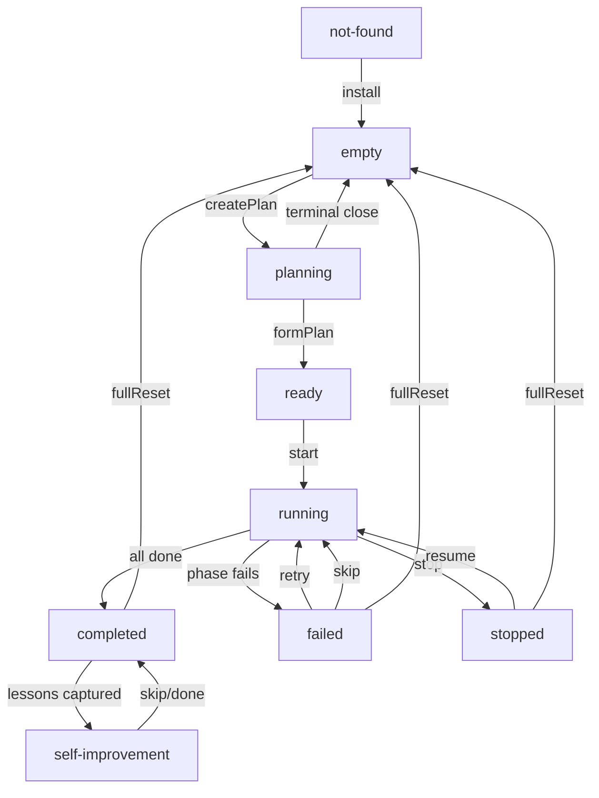

# User Flows

Generated from source. Do not edit manually — regenerate: `npm run generate:flow`

## User Journeys

### UJ-1: First-time setup

```
[not-found] --install--> [empty]
```

### UJ-2: Create and execute plan

```
[empty] --createPlan--> [planning] --formPlan--> [ready] --start--> [running] --(done)--> [completed]
```

### UJ-3: Handle failure

```
[failed] --retry--> [running] --(done)--> [completed]
```

### UJ-4: Skip failed phase

```
[failed] --skip--> [running] --(done)--> [completed]
```

### UJ-5: Resume stopped work

```
[stopped] --resume--> [running] --(done)--> [completed]
```

### UJ-6: Self-improvement flow

```
[completed] --(auto: lessons)--> [self-improvement] --skip--> [completed]
```

### UJ-7: Restart from scratch

```
[completed] --fullReset--> [empty]
```

### UJ-8: Cancel plan creation

```
[planning] --(terminal close)--> [empty]
```

## Full State Diagram



## Views

- `not-found`
- `empty`
- `ready`
- `running`
- `stopped`
- `failed`
- `completed`
- `planning`
- `self-improvement`